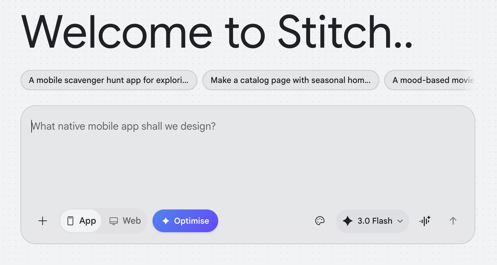

# Stitch Prompt Optimiser

A Chrome extension that adds an **Optimise** button to [Google Stitch](https://stitch.withgoogle.com/), transforming rough prompts into structured, high-quality prompts that produce better UI designs.

Powered by **Gemini 3 Flash Preview** via the Google AI Studio API.



## Why use this

Stitch's output quality is highly sensitive to how prompts are written. The better you articulate your intention — with specific component names, hex colours, layout structure, and visual tone — the more accurate and complete the generated design.

A few things the community has discovered through heavy use:

- **Prompts over ~5,000 characters cause Stitch to omit components.** You need to be precise *and* concise.
- **Stitch doesn't remember previous context** unless you're extremely explicit and incremental. Every prompt should be self-contained.
- **Vague adjectives produce generic output.** "Modern" means nothing; "clean, minimal, with generous whitespace and a tight 8px grid" does.
- **Google's own enhance-prompt skill** (from the official [stitch-skills repo](https://github.com/google-labs-code/stitch-skills), 5,000+ weekly installs) codifies a specific structure — Design System block + numbered Page Structure — that reliably produces better results.

This extension applies all of that automatically, so you can write naturally and get a production-quality prompt without thinking about format.

## What it does

When you type a casual prompt like:

> A clean dashboard for a SaaS analytics tool. Dark mode, modern feel. Show charts, user stats, and recent activity.

The extension rewrites it into a structured prompt following all official Stitch best practices:

> A sophisticated SaaS analytics dashboard with a dark, data-dense layout. Clean, minimal design with strong visual hierarchy and purposeful use of colour to surface key metrics.
>
> DESIGN SYSTEM:
> - Platform: Web, Desktop-first
> - Theme: Dark, professional, data-focused
> - Background: Deep Navy (#0f172a)
> - Primary Accent: Electric Blue (#3b82f6) for interactive elements and highlights
> - Surface: Slate (#1e293b) for cards and panels
> - Text Primary: White (#f8fafc)
> - Text Secondary: Muted Grey (#94a3b8) for labels and captions
> - Typography: Clean sans-serif, medium weight headings, tabular figures for numbers
> - Buttons: Rounded corners (6px), solid primary and ghost variants
>
> PAGE STRUCTURE:
> 1. Top navigation bar: Logo left, global search centre, user avatar and notifications right
> 2. KPI row: Four stat cards showing key metrics with trend indicators (up/down arrows, percentage change)
> 3. Main chart area: Large line chart for traffic over time, toggle for daily/weekly/monthly
> 4. Secondary row: Donut chart for traffic sources left, recent activity feed right
> ...

This structured format dramatically improves Stitch's output quality.

## Installation

1. Download or clone this repository
2. Open Chrome and navigate to `chrome://extensions/`
3. Enable **Developer mode** (toggle in top-right)
4. Click **Load unpacked** and select the `stitch-optimiser` folder
5. Click the extension icon in your toolbar and enter your [Google AI Studio API key](https://aistudio.google.com/apikey)

## Usage

1. Go to [stitch.withgoogle.com](https://stitch.withgoogle.com/)
2. Type your prompt as normal in the input field
3. Click the **✦ Optimise** button (appears next to the App/Web toggle)
4. Review the enhanced prompt — it preserves all your original details
5. Click **Generate designs** as normal

## How it optimises

The extension applies the following techniques from the [official Stitch Prompt Guide](https://discuss.ai.google.dev/t/stitch-prompt-guide/83844):

- **Structured sections** — organises into Design System + Page Structure format
- **UI/UX keywords** — replaces vague terms with precise component names
- **Vibe amplification** — expands terse adjectives into richer visual descriptions
- **Colour formatting** — resolves brand colours to hex values with functional roles
- **Platform inference** — adds Web/Mobile and Desktop/Mobile-first context
- **Imagery guidance** — describes the style of images where relevant
- **Length control** — keeps output under 2500 characters to avoid Stitch omitting components

## API key & privacy

- Your API key is stored locally in Chrome's extension storage (`chrome.storage.local`)
- It is sent only to `generativelanguage.googleapis.com` (Google's Gemini API)
- No data is sent to any third-party server
- No analytics or tracking

## Cost

Gemini 3 Flash Preview has a free tier on Google AI Studio. Each optimisation call uses roughly 500–1000 input tokens and 500–800 output tokens, so the cost at paid rates would be fractions of a penny per use.

## Files

```
stitch-optimiser/
├── manifest.json      # Extension manifest (Manifest V3)
├── content.js         # Injected script — button + Gemini API logic
├── content.css        # Button and toast notification styles
├── popup.html         # API key management popup
├── popup.js           # Popup logic
├── assets/
│   └── screenshot.png
└── icons/
    ├── icon16.png
    ├── icon48.png
    └── icon128.png
```

## Requirements

- Chrome 88+ (Manifest V3 support)
- A Google AI Studio API key ([get one free](https://aistudio.google.com/apikey))
